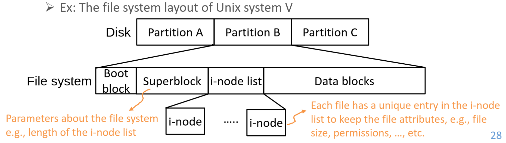
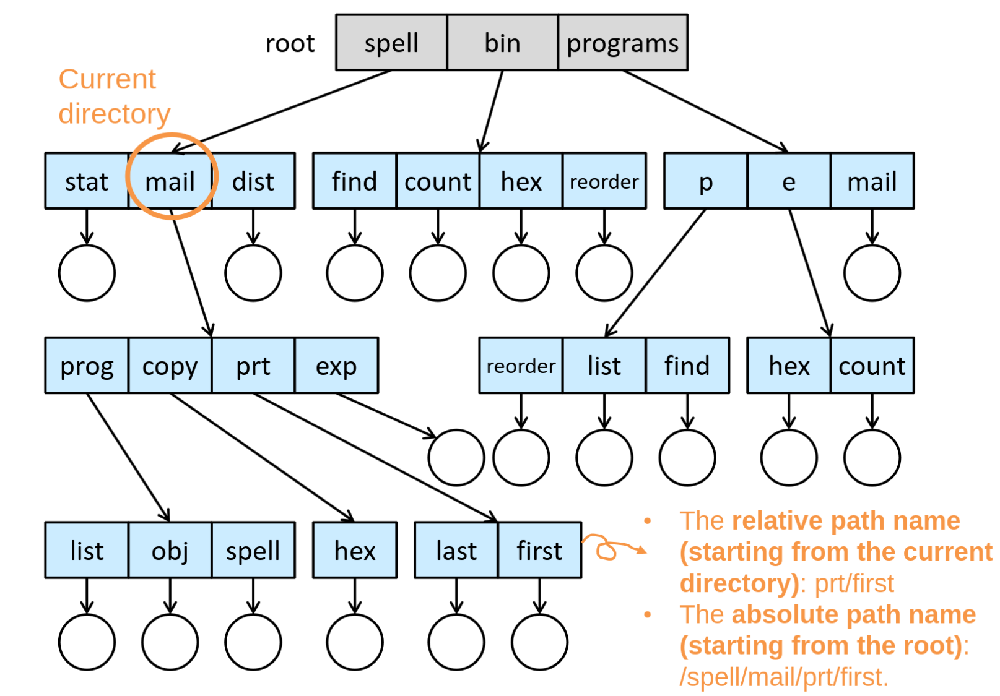
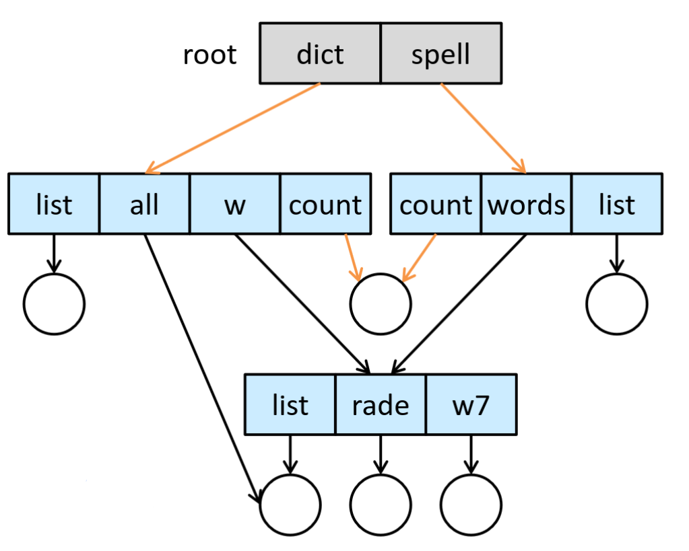
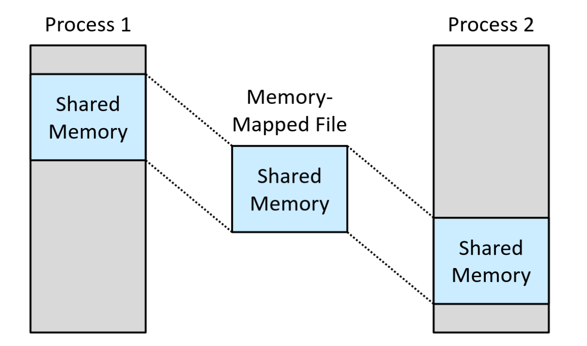

## Basic
**file** is a logical storage unit
## attributes
+ Name (human-readable form), identifier (**Unique tag**), type, location (a pointer), size
+ protection (access-control information, who can read, write, execute?)
+ timestamps (time of creation, last modification, execution)
+ user identification (who create/ last modified)
+ extended file attributes (such as checksum, encoding)
### directory
a collection of nodes containing info of all files
### operation
A file is a abstract data type, we can for example do:
+ write at a write pointer position
+ read at a read pointer position
+ reposition (`fseek`): move the pointer
+ delete
+ truncate: erase all contents without changing attributes
+ close: move all contents to the directory in the disk
### open-file table
two levels.
#### per-process
track all files a process open, also maintain access rights and file pointer and accounting info (e.g. size)
#### system-wide
It's kept in the memory

each entry of the per-process open-file table points to here. It contain process-independent info, e.g. open count, location on the disk, access dates, size.
### lock
1. shared-lock (Multiple process can access) and exclusive lock (Only one process at a time can access)
2. advisory lock (Unix) and mandatory lock (Windows)
### structure
If OS support many file structures, the OS size will be larger (the code for supporting various file types, definition of file types...)

## Access methods
### sequential
Info is processed in order, one record after one another.

It can be implemented through direct access.
### Direct access (Relative access)
It's based on disk model. 
A file is made up of a fixed-length logical records (a numbered sequence of blocks or records), this method allow **random access**

Operation should specify the any block $n$ (a relative block number), e.g. `read(n), write(n)`. An alternative approach is moving first, then doing sequential access.

### index access method
We have a index file, which contain pointers to various blocks. (So we don't need to know the actual block number). The method is often used in the *database*

But, the index file might become too large. A solution is to use a smaller master index that points to disk blocks of secondary indices. The secondary indices point to the actual file blocks. (IBM indexed-sequential-access method, ISAM).

OpenVMS implementation: In the index file, use a key to find logical record number, then use the number to locate the corresponding entry in the relative file.

## Directory structure

A **partition** can be a portion of a disk or a group of multiple disks (i.e. distributed file systems).

A **volume** is a formatted partition with a file system, each volume contains a file system  and track the file system info in the **device directory**.

So, directory is a symbol table that translates file name to file control blocks (see above).

### Single-level structure
All files are stored in one directory, so they must have distinct names. This scheme has many limitations when number of files increase or multiple users exist.
### Two-level structure
There's a separate directory for all users (**Master file directory**), under it, each user has a **User File Directory (UFD)**, all files of the user are stored there. Therefore, a username and a filename defined a certain pathname, searching in two-level structure is efficient.
### Tree-structured structure
Just tree structure.

+ current working directory could be changed by user, shell can track and operate on it.
+ One bit in each directory entry to define if it's a subdirectory (1) or a file (0)
+ Some system will not delete non-empty directory.
### Acyclic graph structure
It allow different directories to share a subdirectory or a file through **link** (pointer to locate the file), here a file might have multiple absolute paths.

A **hard link** points to the i-node of the shared file, we should keep a reference count in i-node.

A **soft link** is a created file that contains a path to the shared file, we find the shared file using the path in the soft link.

In soft link scenario, a **dangling pointer** will occurs if the pointed path is deleted, solution includes:
+ keep a list of reference to a file, preserve the file until the list is empty
+ search for the links and delete them as well.
+ the access is considered as illegal if some operation is made.
### General graph structure
There might be cycles (or **self-referencing**) if we adopt links in tree structure, there might be:
+ infinite loops for searching
+ RC being not zero even though it's not possible to refer anything in the cycle
We can solveit using:
+ **Garbage collection scheme**: Traverse entire filesystem, marking all accessible things. Then free all unmarked things by traversing again. But it's time consuming.
+ Cycle detection algorithm used when link is created.

## Protection
### types
I just list some special ones:
+ list: list the name and attributes of a file
+ attribute change
+ read, write, append, execute, delete
### ACL (access control list), access control
We can associate each file or directories with an ACL, specifying usernames and the types of access allowed for each user.

We can improve original scheme by combining ACL and 3 classifications of users (user, group, others) and modes.
## Memory-mapped files
The file on the disk is mapped to the memory first, then multiple processes map their virtual memory to the same memory-mapped file, this scheme also support copy-on-write.
