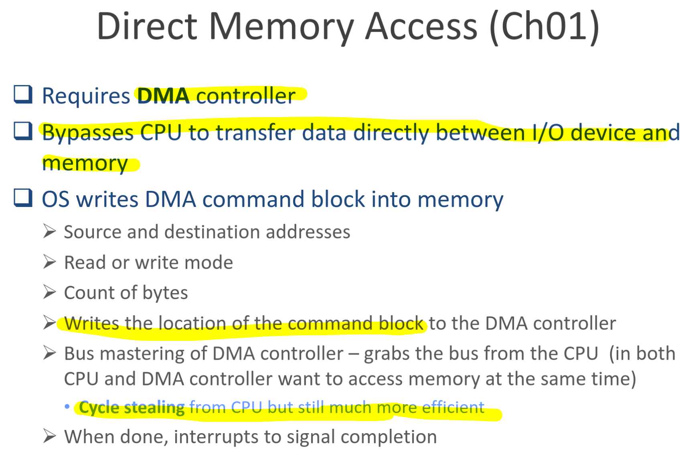
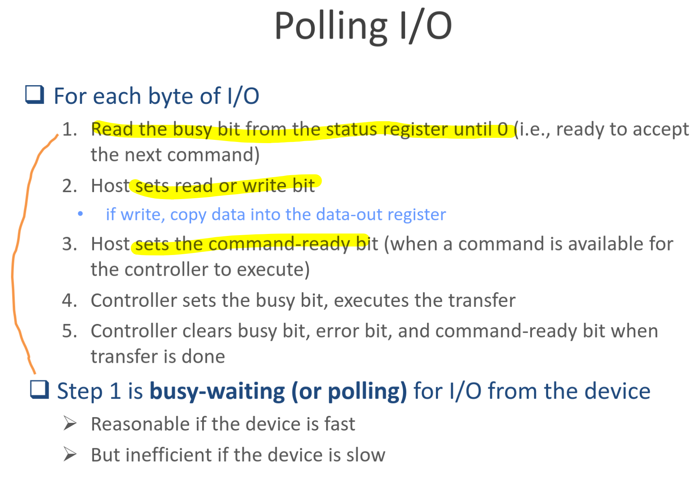

## Overview
**Device driver** provides uniform device-access interface to I/O subsystem.

## I/O hardware
### terms
+ **Port** is a connection point for a device
+ **Bus**: wires+well-defined protocol that specifies the message sent over the wires.
+ **Controller (Host adapter)**: a collection of electronics that can operate ports, bus, devices. It has its own buffer, [microcode](https://en.wikipedia.org/wiki/Microcode), processor, bus controller, private memory

不知道要放哪裡
[PCIe](https://en.wikipedia.org/wiki/PCI_Express)is a high-speed standard used to connect hardware components inside computers.

### Port mapped I/O vs. memory mapped I/O
Port mapped I/O (Or *direct I/O instructions*) means the transfer of the data to an I/O port address.

In memory mapped I/O, the device control register (i.e. buffer) are first mapped into the address space of the processor. Everything is done in the physical memory. (read, write, MOV). *It's more efficient for large address space.*

### I/O methods

其實我沒有很懂 cycle stealing 在幹嘛，但我找到一篇別人寫的[筆記](https://hackmd.io/@pipibear/HyRI8kdPp)，之後複習的時候可以看:)

